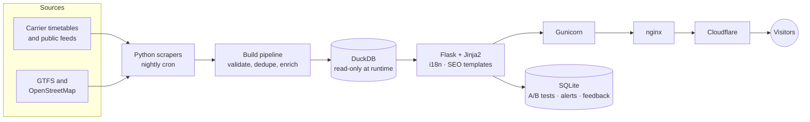
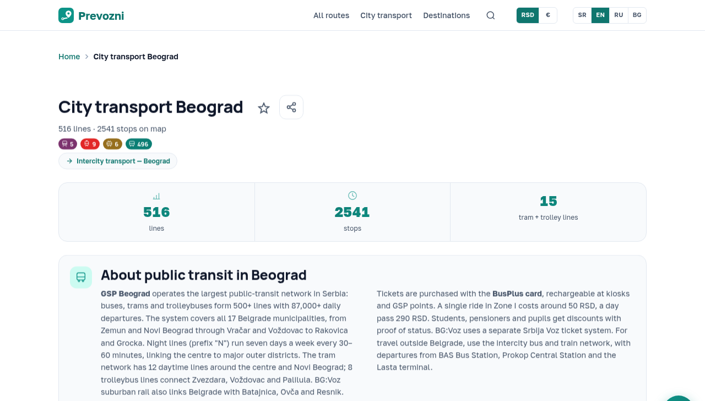

# Prevozni

**Free timetables and city transit maps for Serbia & Montenegro** — intercity buses and trains, plus public transport in seven cities, in four languages.

[**prevozni.com →**](https://prevozni.com) &nbsp;·&nbsp; Live in production &nbsp;·&nbsp; Solo project

> The source code is private. This repository is a case study: what the product does, how it is put together, and what running it taught me.

## What it does

- **Intercity routes** — bus and train departures with fares from the carriers' own public timetables, one page per route (about 510 priced routes from 20 carriers).
- **City transit** — line pages with route maps, stop pages with next-departure estimates, and pair pages ("how do I get from A to B") for Belgrade, Novi Sad, Niš, Kragujevac, Podgorica, Budva and Herceg Novi. Belgrade alone has 516 lines and 2,541 stops.
- **Search and autocomplete** across cities, stops and routes.
- **Four languages** (Serbian, English, Russian, Bulgarian) with proper `hreflang` and localized URLs.
- Prices in **RSD or EUR**, chosen by an A/B test rather than by opinion.
- No account, no sign-up.

## How it is built

| Layer | Choice | Why |
|---|---|---|
| Web | Flask, Jinja2 | Server-rendered pages: fast first paint, crawlable by default |
| Data | DuckDB, built nightly | Timetables are read-mostly; one file, no DB server, easy to rebuild and to roll back |
| User data | SQLite | Small, transactional, backed up nightly (restore tested) |
| Serving | Gunicorn → nginx → Cloudflare | Unix socket behind nginx, Cloudflare in front for TLS and caching |
| Ops | systemd, cron, a `/health` endpoint | Self-healing restart, and a health check that reports *degraded* when a nightly step fails instead of failing silently |
| Quality | pytest (1,100+ tests) | Guards the parts that break quietly: URL structure, sitemaps, `hreflang`, i18n keys, indexing rules for thin pages, price sanity checks |

## Things I'm happy with

- **Programmatic SEO without thin pages.** Thousands of stop, line, route and city-pair pages are generated from data. Pages with nothing real to say return `noindex` (or a 404 when neither side of a pair exists) instead of padding the index. Titles and meta descriptions are kept within length limits per page type.
- **Own A/B framework.** Server-side variant assignment, conversion tracking and significance checks — used to pick the default currency (RSD won clearly) and to find out that a copy test would never reach significance at the current traffic.
- **A data pipeline that tells on itself.** Every nightly step writes its outcome to a status file; `/health` surfaces failed steps and stale feeds (for example, a GTFS feed older than 45 days).
- **Boring performance and accessibility work that pays.** Minified CSS/JS with every file syntax-checked at build time, WCAG-AA contrast fixes, labelled controls, JSON-LD on route pages.

## Screens

<table>
  <tr>
    <td width="66%"></td>
    <td width="34%"></td>
  </tr>
  <tr>
    <td align="center">City transit page — Belgrade</td>
    <td align="center">Home on a phone</td>
  </tr>
</table>

## Lessons

- A conversion tracker that silently matches nothing is worse than no tracker: one of mine pointed at the wrong CSS selector for months. I now verify an experiment's events end to end before trusting its numbers.
- Third-party models get retired. A nightly step that "succeeds" with empty output is a bug: after a retired model produced nothing for weeks, errors are logged and failed steps show up in `/health`.
- I would rather index fewer real pages than a large pile of thin ones, so thin pages are `noindex` by rule, not by hand.

---

Built and run by [@klaschukk](https://github.com/klaschukk).
